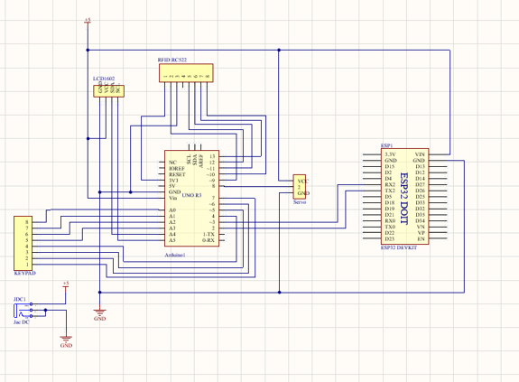
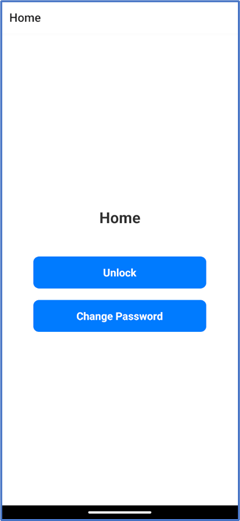
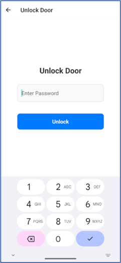
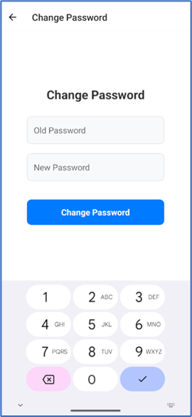

# Door Lock System using Arduino Uno R3 and ESP32

## Description

This project utilizes Arduino Uno R3 and ESP32 to create a smart door lock system. The system allows users to remotely control the door lock via Wi-Fi using HTTP requests from a smartphone connected to a Node.js server. It also supports unlocking the door using an RFID card and entering a password via a keypad.

## Table of Contents

1. [Introduction](#introduction)
2. [Components](#components)
3. [Installation](#installation)
4. [Usage](#usage)
5. [Keypad Instructions](#keypad-instructions)
6. [Contributing](#contributing)

## Introduction

This smart door lock system is designed to provide a convenient and secure solution for home entry. Using an Arduino Uno R3 to control an electronic lock and an ESP32 to connect to a Wi-Fi network, the system supports multiple methods of access:

- Remote control via HTTP requests
- RFID card authentication
- Password entry via a keypad

## Components

1. **Arduino Uno R3**
2. **ESP32**
3. **MFRC522 RFID Module**
4. **4x4 Keypad**
5. **Servo Motor**
6. **LCD Display with I2C Module**

## Installation

### Hardware Setup

1. Connect the hardware components as per the circuit diagram.
2. Ensure that the connections for the RFID reader, keypad, and servo are secure and correct.
   
   

### Software Requirements

1. **Arduino IDE**
2. **Visual Studio Code**
3. **Android Studio**
4. **XAMPP**

### Software Setup

1. **Clone this repository:**
   ```bash
   git clone https://github.com/dihnhuunam/Door-Lock-System.git
   ```
2. **Navigate to the project directory:**
   ```bash
   cd Door-Lock-System
   ```
3. **Setup Node.js Server:**
   - Activate MySQL Server on XAMPP
   ```bash
   cd Server
   ```
   ```bash
   npm install
   ```
   ```bash
   npm start
   ```
4. **Setup Virtual Mobile:**
   - Activate Android Studio
   ```bash
   cd Unlock-App
   ```
   ```bash
   npm install
   ```
   ```bash
   npm start android
   ```
5. **Setup ESP32 WiFi Credential:**
   - WiFi Credentials:
     - SSID: `WiFi's Name`
     - Password: `WiFi's Password`
   - Server Details:
     - IP: `Localhost IP`
     - Port: `8000`

## Usage

1. After successful installation and connection, the system will connect to your Wi-Fi network.
2. **Remote Control via Mobile App:**

   1. **Press Unlock Button**
   
      

   2. **Enter Password**
   
      

   3. **Enter Old Password and New Password**
   
      

3. **RFID Card Authentication:**
   - Present an authorized RFID card to the RFID reader to unlock the door.
4. **Password Entry via Keypad:**
   - Enter the correct password on the keypad to unlock the door.

## Keypad Instructions

### Entering a Password

#### Entering the Password:
- Use the keypad to enter the password.
- Press the `#` key to submit the password.
- If the password is correct, the door will unlock.
- If the password is incorrect, access will be denied.

### Changing the Password

#### Initiate Password Change:
- Press the `*` key on the keypad.
- The LCD will prompt you to enter the old password.

#### Enter Old Password:
- Enter the old password using the keypad.
- Press the `#` key to submit the old password.
  - If the old password is correct, you will be prompted to enter a new password.
  - If the old password is incorrect, you will see a "Wrong Old Password" message.

#### Enter New Password:
- Enter the new password using the keypad.
- Press the `#` key to submit the new password.
  - The LCD will display "Password Changed" if the password change is successful.
  - If the password change fails, you will see a "Change Failed" message.

### Adding an RFID Card

#### Initiate Add Card Mode:
- Press the `A` key on the keypad.
  - If the password is not verified, you will be prompted to enter the password.
  - After password verification, you will enter the Add Card mode.

#### Scan RFID Card:
- Scan the RFID card that you want to add.
  - The LCD will display "Card Added" if the card is successfully added.
  - If the card is already added, you will see a "Card Already Added" message.
  - If the memory is full, you will see a "Memory Full" message.

### Removing an RFID Card

#### Initiate Remove Card Mode:
- Press the `A` key again on the keypad while in Add Card mode to switch to Remove Card mode.
  - The LCD will display "Remove Card Mode".

#### Scan RFID Card:
- Scan the RFID card that you want to remove.
  - The LCD will display "Card Removed" if the card is successfully removed.
  - If the card is not found, you will see a "Card Not Found" message.

### Mode Selection

#### Cycle Through Modes:
- Press the `A` key to cycle through Normal, Add Card, and Remove Card modes.
  - The LCD will display the current mode.

#### Verify Password for Adding/Removing Cards:
- If the password is not verified, you will be prompted to enter the password before you can add or remove cards.

### Special Keys

- `#`: Submit entered password.
- `A`: Change mode (Add Card, Remove Card, Normal).
- `*`: Initiate password change.
- `B`: Delete the last entered digit.
- `C`: Clear all entered digits.
- `D`: Return to the password entry screen.

## Contributing

We welcome contributions! Please create a pull request or report an issue to help us improve this project.
